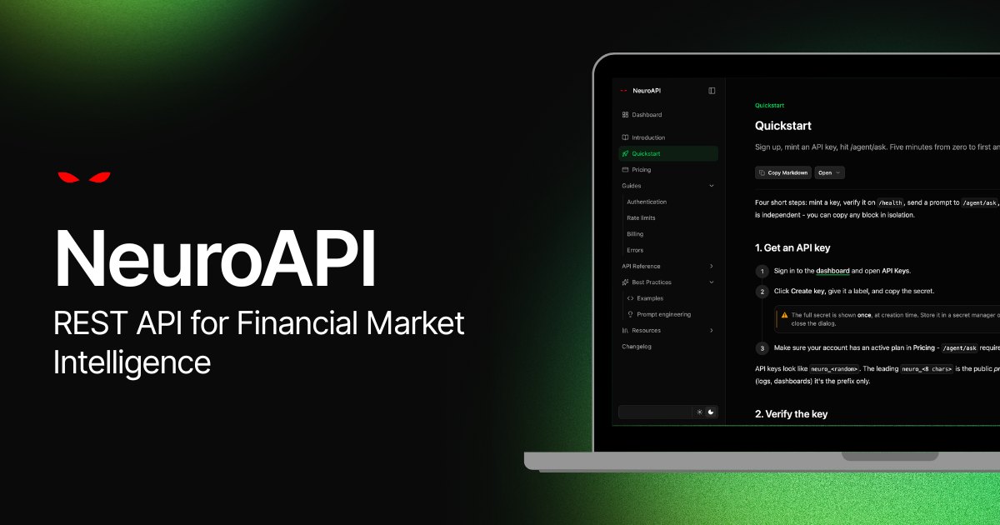

<p align="center">
  
</p>

<h1 align="center">NeuroAPI Cookbook</h1>

<p align="center">
  Practical, runnable recipes for building with <a href="https://neuroapi.neurobro.ai/docs">NeuroAPI</a>, Neurobro's API for financial market intelligence.
</p>

<p align="center">
  <a href="https://neuroapi.neurobro.ai/docs"></a>
  
  <a href="LICENSE"></a>
</p>

---

Practical examples for building with [NeuroAPI](https://neuroapi.neurobro.ai/docs), Neurobro's paid public API for finance. The cookbook is intentionally small: each recipe focuses on one production pattern and can be run from a terminal or copied into an application.

NeuroAPI has a compact public surface:

- `GET /api/v1/health` verifies your API key without consuming billable units.
- `POST /api/v1/agent/ask` asks the agent and returns either one JSON response or a Server-Sent Events stream.
- Authentication uses `X-API-Key`, not bearer tokens.
- The caller owns conversation state through `message_history`.
- `usage.cost_units` is the billing contract for successful `/agent/ask` calls.

## Start Here

1. Create an API key in the [NeuroAPI dashboard](https://neuroapi.neurobro.ai/).
2. Copy `.env.example` to `.env` and set `NEUROAPI_KEY`.
3. Install dependencies:

```bash
python3 -m venv .venv
source .venv/bin/activate
pip install -r requirements.txt
```

If you use `uv`:

```bash
uv sync
```

Run the first example:

```bash
python3 examples/01_getting_started.py
```

## Examples

| Example | What it demonstrates |
| --- | --- |
| [01_getting_started.py](examples/01_getting_started.py) | Verify a key with `/health`, make a sync `/agent/ask` call, inspect `usage` and `X-Request-Id`. |
| [02_multi_turn_research_chat.py](examples/02_multi_turn_research_chat.py) | Build a stateless research chat by resending prior turns with `message_history`. |
| [03_streaming_sse.py](examples/03_streaming_sse.py) | Stream an answer over Server-Sent Events and render answer chunks as they arrive. |
| [04_resilient_client.py](examples/04_resilient_client.py) | Wrap `/agent/ask` with retry handling for `429` and `503`, `Retry-After`, idempotency keys, and structured errors. |
| [05_structured_market_report.py](examples/05_structured_market_report.py) | Ask for constrained JSON and validate the answer with Pydantic before using it downstream. |

See [examples/README.md](examples/README.md) for usage notes and extension ideas.

## Configuration

All examples read these environment variables:

| Variable | Default | Description |
| --- | --- | --- |
| `NEUROAPI_KEY` | required | Your API key, created in the NeuroAPI dashboard. |
| `NEUROAPI_BASE_URL` | `https://api.neurobro.ai/api/v1` | Override for staging, local development, or tests. |

Never hardcode API keys in notebooks, scripts, issue reports, or commits. The full key is shown only once in the dashboard.

## API References

- [NeuroAPI docs](https://neuroapi.neurobro.ai/docs)
- [Quickstart](https://neuroapi.neurobro.ai/docs/quickstart)
- [Authentication](https://neuroapi.neurobro.ai/docs/guides/authentication)
- [Rate limits](https://neuroapi.neurobro.ai/docs/guides/rate-limits)
- [Billing](https://neuroapi.neurobro.ai/docs/guides/billing)
- [Errors](https://neuroapi.neurobro.ai/docs/guides/errors)
- [API reference](https://neuroapi.neurobro.ai/docs/api)

## Cookbook Style

This repo follows the same practical pattern as the major API cookbooks:

- Root README as the navigation map.
- Small, runnable examples instead of framework-heavy demos.
- Environment variables for secrets.
- Clear production notes for state, streaming, retries, cost, and validation.
- Contributions focused on complete recipes that developers can run end to end.

## Contributing

See [CONTRIBUTING.md](CONTRIBUTING.md). New examples should be self-contained, finance-relevant, and safe to run with a real API key. Examples are formatted and linted with [Ruff](https://docs.astral.sh/ruff/); CI runs `ruff check` and `ruff format --check` on every pull request.

## License

Released under the [MIT License](LICENSE).
